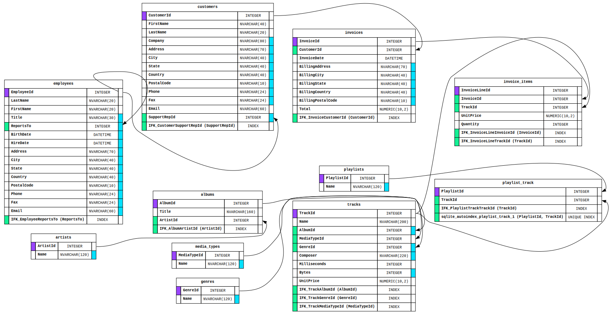

# SQLiteViz

Go application that creates simple diagrams from your SQLite database schemas.

Install with:

    go install github.com/n0x1m/sqliteviz@latest

Cli usage:

```sh
Usage of ./sqliteviz:
  -db string
        sqlite database path
  -ignore value
        tables to ignore
```

Examples

```sh
# to dotfile
sqliteviz db.sqlite3 > output.dot
# to png
sqliteviz db.sqlite3 | dot -Tpng > output.png
# to svg
sqliteviz db.sqlite3 | dot -Tsvg > output.svg
# using flags and with ignore list
sqliteviz -db db.sqlite3 -ignore schema_migrations,sqlite_stat1 > output.dot
```

## Example

Chinook is a sample database available for SQLite and other databases. It's an
alternative to the Northwind database and is meant for demos and testing ORM
tools. It can be created by running a single SQL script. The following sample
was generated against Chinook with:

```sh
sqliteviz -db chinook.db -ignore schema_migrations,sqlite_stat1 > example/chinook.dot
sqliteviz -db chinook.db -ignore schema_migrations,sqlite_stat1 | dot -Tsvg > example/chinook.svg
```



See the corresponding [Graphviz dot file](./example/chinook.dot) that was
generated.
